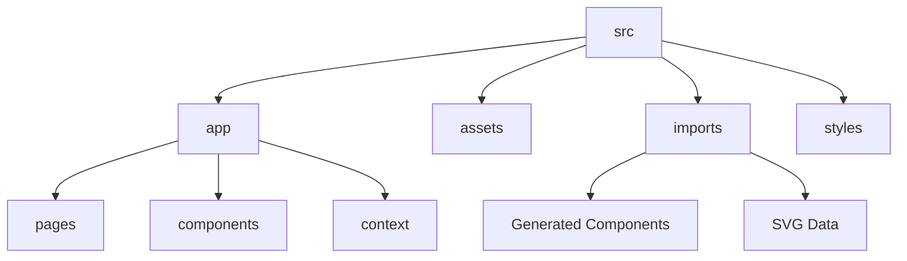

# 🏙️ Daffodil Software Ltd - Corporate Platform

[](https://react.dev/)
[](https://vitejs.dev/)
[](https://tailwindcss.com/)

A premium, high-performance corporate ecosystem built for **Daffodil Software Ltd**. This application transforms sophisticated Figma designs into a fluid, responsive, and accessible web experience, engineered for scalability and world-class user engagement.

---

## 🚀 Experience the Performance

### 🛠️ Prerequisites

- **Node.js**: v18.0 or later (LTS recommended)
- **Package Manager**: `npm` or `pnpm`

### 🏗️ Setup & Development

1.  **Clone & Install**:
    ```bash
    git clone [repository-url]
    cd "Daffodil Software Ltd"
    npm install
    ```
2.  **Launch Dev Server**:

    ```bash
    npm run dev
    ```

    ✨ _Access the dashboard at `http://localhost:5173`_

3.  **Production Build**:
    ```bash
    npm run build
    ```
    📦 _Optimized assets generated in `/dist`_

---

## � Technical Architecture

### Core Engine

- **Framework**: [React 18](https://react.dev/) for component-driven development.
- **Routing**: [React Router 7](https://reactrouter.com/) with dynamic route matching and layout persistence.
- **State Management**: Context API for lightweight, efficient state synchronization across features.

### Aesthetic Design System

- **Tailwind CSS 4**: Utilizing the latest JIT engine for lightning-fast styling and custom theme tokens.
- **GSAP & Motion**: Orchestrating high-end entrance animations, scroll-triggered effects, and micro-interactions.
- **Typography**: Premium font sets (Helvetica Now Display, Inter) integrated for maximum readability and brand alignment.

---

## 📂 Structural Intelligence

The project follows a modular architecture designed for clarity and rapid feature isolation:



- **`src/app/pages/`**: Single-responsibility page components.
- **`src/app/components/`**: Atomic and molecular UI sections.
- **`src/imports/`**: Design-driven assets and structural blueprints exported from Figma.
- **`src/assets/`**: High-resolution imagery and static media.
- **`src/styles/`**: Global theme definitions, utility classes, and typography.

---

## �️ Smart Path Aliasing

Streamlined imports using defined aliases for cleaner, more maintainable code:

| Alias           | target                 | Intent                              |
| :-------------- | :--------------------- | :---------------------------------- |
| `@/*`           | `src/*`                | Root-level source access            |
| `@components/*` | `src/app/components/*` | Rapid component instantiation       |
| `@pages/*`      | `src/app/pages/*`      | Page-level routing                  |
| `@imports/*`    | `src/imports/*`        | Bridging design with implementation |
| `figma:asset/*` | `src/assets/*`         | Direct media resolution             |

---

## 🎨 Creative Vision

This platform is a direct implementation of the **Daffodil Software Design Language**.
🔗 [View the Original Figma Masterpiece](https://www.figma.com/design/vCwb5pnlIxpTdYZ8B5H2p1/Daffodil-Software-Ltd)

---

## � Standards & Contributing

We maintain a high bar for code quality and design fidelity. Please review our [Internal Guidelines](./guidelines/Guidelines.md) before submitting pull requests.

&copy; 2026 Daffodil Software Ltd. All rights reserved.
